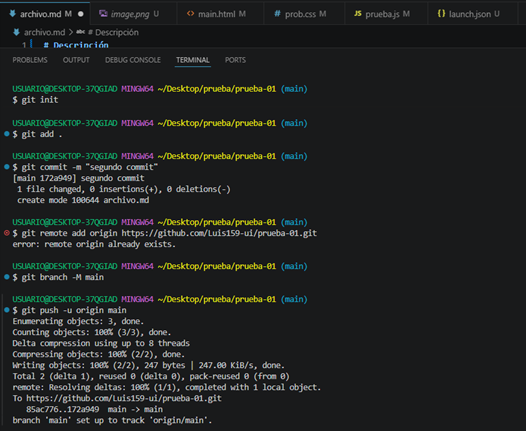
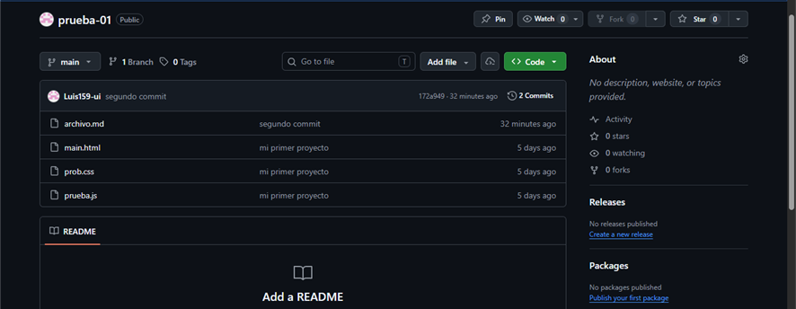

<div align="center">
  <h1>❖ Reporte de Laboratorio</h1>
  <p><i>Curso: Pruebas y Aseguramiento de Calidad de Software</i></p>
  
  
  
</div>

---

## ✦ Datos Personales

<details open>
<summary><b>⯈ Ver detalles del estudiante</b></summary>
<br>

- ⬢ **Nombre:** Luis Rene Carrillo Cardenas 
- ⬢ **Especialidad:** Desarrollador de Software

</details>

---

## ◎ Objetivo del Laboratorio
> ➤ **Enfoque Principal:** Comprender la utilidad e implementar correctamente las herramientas de control de versiones mediante **Git** y su integración con entornos de desarrollo modernos.

---

## ⚙ Desarrollo de la Práctica

### ◩ Resumen de Pasos Realizados
1. **Inicialización:** Crear un repositorio local en Git para seguimiento de archivos.
2. **Registro de Versiones:** Guardar y confirmar los archivos creados en el editor de código (`Visual Studio Code`) usando la línea de comandos.
3. **Despliegue Remoto:** Conectar el repositorio local y subir los cambios a un servidor remoto (GitHub) para su respaldo y colaboración.

### ⌨ Comandos Ejecutados
A continuación, se detalla el flujo de trabajo utilizado en la terminal:

```bash
git init                                                              # Inicializa un repositorio local nuevo
git add .                                                             # Agrega todos los archivos al área de preparación (staging)
git commit -m "primer commit"                                         # Crea un punto de control con los cambios actuales
git remote add origin https://github.com/Luis159-ui/prueba-01.git     # Vincula el repositorio local con el origen remoto
git branch -M main                                                    # Renombra o define la rama principal como 'main'
git push -u origin main                                               # Sube los cambios y establece el rastreo al repositorio remoto
```

---

## ◧ Evidencias Fotográficas

<div align="center">
  <table>
    <tr>
      <td align="center"><b>⯀ Resultado 1</b></td>
      <td align="center"><b>⯀ Resultado 2</b></td>
    </tr>
    <tr>
      <!-- Uso de HTML para centrar y limitar el tamaño de las imágenes en vista previa -->
      <td></td>
      <td></td>
    </tr>
  </table>
</div>
